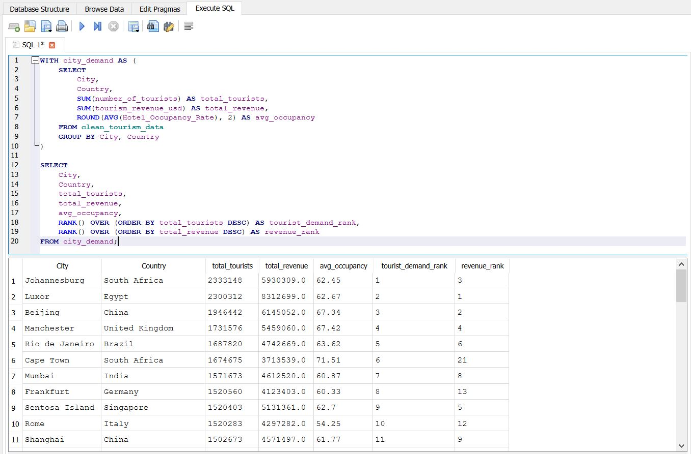
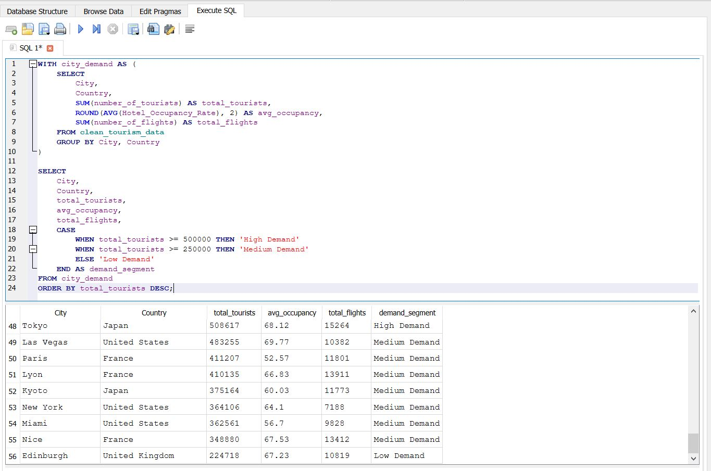

# 🚗 Tourist Demand Forecasting & Car Rental Pricing Strategy

## Project Overview

This case study analyzes the relationship between tourism demand and car rental pricing to support data-driven revenue and pricing decisions. Using Excel, SQL, and Tableau, the project evaluates tourist volume, hotel occupancy, flight activity, rental prices, supplier performance, and seasonal demand patterns to identify pricing opportunities for car rental companies.

## Business Problem

Car rental companies operate in a demand-sensitive market where tourism activity, flight volume, hotel occupancy, seasonality, and location can directly influence rental demand and pricing.

Without a structured demand and pricing analysis, companies may underprice vehicles during peak tourism periods, overprice during low-demand periods, or fail to align fleet availability with travel demand.

This project addresses the need to identify when and where rental pricing can be optimized using tourism demand indicators and car rental market data.

## Objectives

- Analyze tourism demand across cities, countries, months, and years
- Identify seasonal tourism patterns and peak travel periods
- Compare car rental pricing across airports, suppliers, vehicle groups, and transmission types
- Evaluate supplier performance using ratings, reviews, and value-for-money scores
- Segment demand periods into peak, normal, and low season categories
- Generate pricing strategy recommendations using SQL-based business logic
- Present findings through an interactive Tableau dashboard

## Data

This project uses two datasets:

1. A car rental dataset containing airport, supplier, vehicle, pricing, and customer rating details.
2. A tourism and hospitality dataset containing tourism demand, hotel occupancy, flight activity, tourism revenue, and visitor satisfaction indicators.

The datasets were prepared in two stages:

### Raw Data

The raw data files contain the original imported datasets:

- `car_rental_sample_raw.csv` — raw car rental pricing and supplier data
- `tourism_hospitality_raw.csv` — raw tourism and hospitality industry data

### Cleaned Data

The cleaned files were created for SQL analysis and Tableau dashboarding:

- `clean_car_rental_data.csv` — cleaned car rental dataset with numeric pricing fields and standardized columns
- `clean_tourism_data.csv` — cleaned tourism dataset with numeric tourism, revenue, flight, and occupancy fields

## Tools Used

- Excel – Initial data review, cleaning, validation, and preparation of raw datasets
- SQL / SQLite – Data validation, cleaning views, aggregations, CTEs, window functions, ranking, segmentation, seasonality analysis, and pricing recommendation logic
- Tableau – Interactive dashboard development, tourism demand visualization, car rental pricing analysis, and business storytelling

## SQL Analysis

SQL was used to validate, clean, transform, and analyze the tourism and car rental datasets before dashboard development.

The SQL analysis includes:

- Data preview and quality checks
- Missing value checks
- Clean SQL views for both datasets
- Tourism demand analysis by city, country, month, and year
- Car rental pricing analysis by airport, supplier, vehicle group, and transmission type
- Supplier performance analysis using ratings and value-for-money scores
- Demand segmentation using `CASE WHEN`
- City demand ranking using `RANK()`
- Seasonality classification using CTEs
- Pricing opportunity analysis
- Pricing strategy recommendation logic
- Final SQL outputs for Tableau dashboarding

SQL file: `sql/tourist_demand_car_rental_analysis.sql`

## SQL Screenshots

### Advanced SQL Query



### SQLite Data Preview



## Dashboard Preview

Dashboard screenshot will be added here.

```markdown

## Recommendations
- Adjust pricing strategies based on peak and off-peak tourist demand.
- Use forecasted demand to support fleet allocation and availability planning.
- Monitor seasonal and event-driven demand shifts to improve revenue decisions.
- Incorporate dashboard insights into pricing, inventory, and commercial planning.
